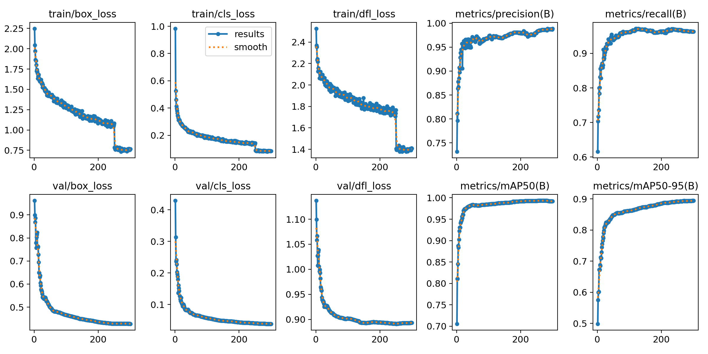
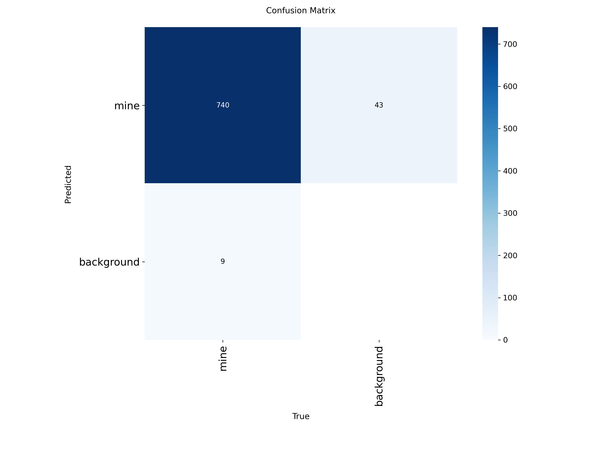
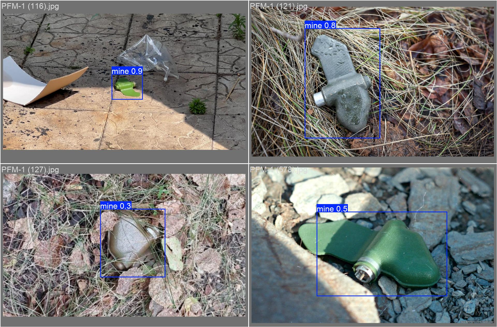

# 📊 Results-Training-Model: PFM-1 Detection Results

Цей репозиторій містить верифіковані результати навчання та валідації нейронної мережі **YOLOv11** для задачі автоматизованого виявлення протипіхотних мін **ПФМ-1 («Пелюстка»)**. Дані зібрані в рамках наукового дослідження щодо моніторингу територій з низькою інформативністю візуальних даних.

## 🎯 Ключові показники (Final Metrics)

Після 300 епох навчання на базі архітектури Anchor-Free було досягнуто наступних результатів:

| Метрика | Значення | Опис |
|---------|----------|------|
| **mAP@0.5** | **99.19%** | Загальна точність розпізнавання |
| **Precision** | **98.85%** | Мінімальний рівень хибних спрацювань |
| **Recall** | **96.26%** | Здатність моделі знайти всі об'єкти в кадрі |
| **mAP@0.5:0.95** | **89.43%** | Точність локалізації (Bounding Box) |

### ⚡ Швидкодія (Hardware Inference)
- **Затримка (Latency):** 23.7 мс (на NVIDIA RTX 4060 з використанням TensorRT FP16).
- **Частота кадрів:** ~42 FPS.

---

## 📈 Візуалізація результатів

### Динаміка навчання (Training Progress)
Графіки функцій втрат (Loss) та зростання точності (mAP) за всі 300 епох навчання.

### Матриця помилок (Confusion Matrix)
Демонструє високу роздільну здатність моделі та відсутність плутанини між цільовим класом та фоном.

### Приклад детекції (Inference Example)
Візуалізація роботи моделі на тестових даних. Високий рівень впевненості (Confidence) навіть при зміні ракурсів.

---

## 📂 Вміст репозиторію

Репозиторій містить вихідні дані навчання для забезпечення відтворюваності (reproducibility) результатів:

- `results.csv` — повний лог метрик навчання по кожній епосі.
- `results.png` — зведений графік показників.
- `confusion_matrix.png` — матриця помилок валідації.
- `PR_curve.png` / `F1_curve.png` — детальні графіки точності та повноти.
- `val_batch0_pred.jpg` — приклади успішної детекції на складних фонах.

---

## 🧠 Автори та Дослідження
Цей проєкт є частиною наукової роботи на тему: 
*"Аналіз застосування елементів штучного інтелекту та машинного зору для визначення небезпечних об'єктів в умовах зниження інформативності"*.

**Дослідницька група (ЧДТУ):**
- **Євич Б. В.** — магістр (розробка та навчання моделі).
- **Мелап В. В.** — к.т.н., доцент (науковий керівник).
- **Куницька С. Ю.** — к.т.н., доцент (консультування).

---
*Results generated in April 2026.*
